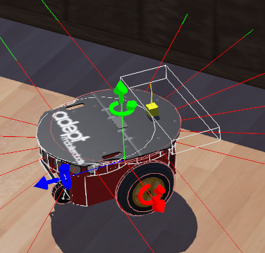

# Desafio 2021

**Candidate:** Lucas Lins Souza

## The Repository

`desafio_2021` - The Webots project folder containing the world file and the controller. 

`video` - Contains 2 demo videos with different simulations of the robot.

`Docu` - Extra content used just for the README.

## The Robot

The goal of the robot Pioneer 3-DX is to navigate the scenario avoiding obstacles in order to reach the zone 
with a floor lamp and a stop sign. To perform this task the robot uses it's pre-installed 16 distance sensors and 2 additional devices: a light sensor and a touch sensor. The light sensor, installed on the top of the Pioneer 3-DX keeps track of the irradiance and sends a sign to the robot when it reads over 750 W/m2, which means it is close enough to the floor lamp. The touch sensor, installed in the front of the robot, prevents it from getting stuck in front of very thin objects like the start sign, witch the distance sensors may not be able to detect. See the distance sensors, the light sensor and the touch sensor installed in the picture below.

The light sensor is represented by the yellow box and the line pointing upwards is the direction in witch the irradiance is detected. The touch sensor has no graphical representation, but you can see it's bounding box in the front of the robot.

## The Controller

The controller file uses the data provided by all the sensors and make decisions that determine the behavior of the robot. The navigation of the robot through the map is determined by a simple state-machine with 4 states that determine whether it should move forward, turn left, right or stop (FORWARD, LEFT, RIGHT STOP). The default state is FORWARD and it only enters the STOP state when it completes it's task (the light sensor reads over 750 W/m2). 

The 16 distance sensors and the touch sensor provides the data that determines whether the robot should move forward or turn. The Pioneer 3-DX is a two-wheel robot and each distance sensor if defined in the controller file as containing a "weight value" for each wheel. This "weight value" is based on the position of the sensor on the robot's body and, therefore, how should it's reading affect the behavior of each wheel. This "weight value" contributes to the decision making if the sensor's reading is less than a minimum value, defined in the controller file. The final data used to determine the behavior of the robot is the sum of all the "weight values" for each wheel multiplied by a "speed_factor", which depends on the ratio of the sensor reading and the minimum distance value. The final result for the left and right wheel determines towards each direction the robot should turn. Once it starts turning, it will continue until no more obstacles are detected and it is able to move forward. If the robot hits an obstacle that could not be detected by the distance sensors, the touch sensor will detect it and make the robot turn right (the reason for choosing to turn right is totally arbitrary) and only move forward again when no more obstacles are detected by the distance sensors nor by the touch sensor.

